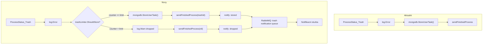
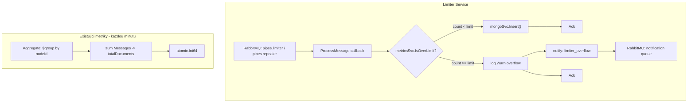

# Ochrana MongoDB pred pretizenim

Plan ma dve casti:

- **Cast A: Bridge trash limiter** -- omezeni zapisu failed messages do kolekce `UserTask`
- **Cast B: Limiter service cap** -- omezeni poctu dokumentu v kolekci `limiter` (buffer pro rate limiter + repeater)

Obe casti sdileji notifikacni frontu v RabbitMQ pro overflow udalosti.

---

# Cast A: Trash Limiter v Bridge

## Kontext

Trash zaznamy se zapisuji v `bridge` metodou `StoreUserTask` v [bridge/pkg/bridge/worker.go](bridge/pkg/bridge/worker.go) (radky 154-168). Kazda zprava se statusem `ProcessStatus_Trash` provede `InsertOne` do MongoDB kolekce `UserTask`. Pri masivnim selhani ciloveho systemu to muze znamenat statisice/miliony zapisu se stejnou pricinou, coz paralyzuje MongoDB.

Bridge je per-topology kontejner, ale **bezi neustale** -- nerestartuje se per proces. Zpravy zpracovava paralelne pres goroutiny (`go n.process(...)` na radku 112). Bridge nevi, kdy proces skoncil (to vyhodnocuje counter service). Citace proto potrebuji **TTL-based eviction**, aby nedochazelo k memory leaku. Existujici vzor pro thread-safe in-memory stav: [bridge/pkg/worker/locker.go](bridge/pkg/worker/locker.go) (`sync.RWMutex` + mapa).

## Tok dat (aktualni vs. novy)



## Soubory ke zmene

### 1. Novy soubor: `bridge/pkg/bridge/trash_limiter.go`

In-memory citac s `sync.Map` + `atomic` operacemi. Klic = `correlationId|nodeId|errorMessage`. Kazdy zaznam obsahuje `born` timestamp a po uplynuti TTL je odstranen cleanup goroutinou.

```go
package bridge

import (
    "context"
    "fmt"
    "sync"
    "sync/atomic"
    "time"
)

type trashEntry struct {
    count int64
    born  int64 // unix millis -- set once on creation
}

type trashLimiter struct {
    counters sync.Map
    limit    int64
    ttlMs    int64
}

func newTrashLimiter(limit int64, ttlSeconds int64) *trashLimiter {
    return &trashLimiter{
        limit: limit,
        ttlMs: ttlSeconds * 1000,
    }
}

func trashKey(correlationId, nodeId, errMsg string) string {
    return fmt.Sprintf("%s|%s|%s", correlationId, nodeId, errMsg)
}

func (tl *trashLimiter) ShouldStore(key string) bool {
    if tl.limit <= 0 {
        return true
    }
    now := time.Now().UnixMilli()
    actual, loaded := tl.counters.LoadOrStore(key, &trashEntry{count: 1, born: now})
    if !loaded {
        return true // first occurrence
    }
    entry := actual.(*trashEntry)
    return atomic.AddInt64(&entry.count, 1) <= tl.limit
}

// startCleanup periodically removes entries older than TTL.
func (tl *trashLimiter) startCleanup(ctx context.Context, interval time.Duration) {
    if tl.ttlMs <= 0 {
        return
    }
    ticker := time.NewTicker(interval)
    defer ticker.Stop()
    for {
        select {
        case <-ctx.Done():
            return
        case <-ticker.C:
            now := time.Now().UnixMilli()
            tl.counters.Range(func(key, value any) bool {
                entry := value.(*trashEntry)
                if now-atomic.LoadInt64(&entry.born) > tl.ttlMs {
                    tl.counters.Delete(key)
                }
                return true
            })
        }
    }
}
```

- `limit <= 0` = brzda vypnuta, vse se zapisuje (zpetna kompatibilita)
- Thread-safe: `sync.Map` + `atomic` (lock-free hot path)
- **TTL eviction**: cleanup goroutina kazdych 5 minut projde mapu a smaze zaznamy starsi nez TTL (vychozi 1 hodina). Po smazani klice se pro danou kombinaci znovu propusti prvnich N zprav -- to je zadouci jako "vzorkovani" pri dlouhotrvajicich problemech
- Pamet: i bez cleanup je overhead minimalni (string klice + 16B struct), ale TTL zajisti, ze mapa neroste neomezene

### 2. Konfigurace: [bridge/pkg/config/config.go](bridge/pkg/config/config.go)

Pridat `TrashLimit`, `TrashLimitTTL` a `TrashNotificationQueue` do struktury `app` (radek 32):

```go
app struct {
    Debug                  bool   `env:"APP_DEBUG" default:"false"`
    TopologyJSON           string `env:"TOPOLOGY_JSON" default:"/srv/app/topology/topology.json"`
    TrashLimit             int64  `env:"TRASH_LIMIT" default:"100"`
    TrashLimitTTL          int64  `env:"TRASH_LIMIT_TTL" default:"3600"`
    TrashNotificationQueue string `env:"TRASH_NOTIFICATION_QUEUE" default:"pipes.trash-notification"`
}
```

- `TRASH_LIMIT=0` = neomezeno (brzda vypnuta)
- `TRASH_LIMIT=100` (default) = prvnich 100 zprav per klic se zapise, zbytek se zahodi
- `TRASH_LIMIT_TTL=3600` (default) = po 1 hodine se citac pro dany klic resetuje (cleanup interval 5 min)
- `TRASH_NOTIFICATION_QUEUE` = nazev RabbitMQ fronty pro trash notifikace; prazdny string = notifikace vypnuty

### 2b. Notifikacni fronta: [bridge/pkg/rabbit/container.go](bridge/pkg/rabbit/container.go)

Pridat `TrashNotification types.Publisher` do `Container` struct (radek 12). V `initServiceQueues` (radek 34):

- Pokud `config.App.TrashNotificationQueue` neni prazdny, deklarovat quorum frontu (stejny vzor jako `pipes.limiter`) a vytvorit publisher
- Pridat `Queue_TrashNotification` do [bridge/pkg/enum/queues.go](bridge/pkg/enum/queues.go)

### 3. Integrace: [bridge/pkg/bridge/worker.go](bridge/pkg/bridge/worker.go)

**a) Pridat `trashLimiter` a `notificationPublisher` do struktury `node`** (radek 38-53):

```go
type node struct {
    // ... existujici pole ...
    trashLimiter            *trashLimiter
    notificationPublisher   types.Publisher // nil = notifikace vypnuty
}
```

**b) Predat v `newNode`** (radek 283): `trashLimiter` a `notificationPublisher` jako nove parametry.

**c) Upravit blok `ProcessStatus_Trash`** (radky 154-168):

Stavajici kod:

```go
if status == enum.ProcessStatus_Trash {
    result.Message().Status = enum.MessageStatus_Trash
    log.Error().Err(result.Error()).EmbedObject(result.Message()).
        Bool(enum.LogHeader_IsForUi, true).Send()
    if trashId, err := n.mongodb.StoreUserTask(result, n.Node.Name, n.topologyName); err != nil {
        log.Error().Err(err).EmbedObject(result.Message()).Send()
        ack = false
    } else {
        trashId := trashId.Hex()
        sendFinishedProcess(result.Message(), enum.StatusType_TrashMessage, &trashId, n.topologyName)
    }
}
```

Novy kod:

- Sestavit `key` z headeru `correlation-id`, `node-id` a `result.Error().Error()`
- Pokud `ShouldStore(key)` vrati `true`: stavajici chovani (StoreUserTask + sendFinishedProcess) + **notifikace** `stored`
- Pokud `false`: log warning + sendFinishedProcess s `nil` + **notifikace** `dropped`
- **Notifikace se posila vzdy** (pro oba pripady) -- publish JSON do notifikacni fronty

Notifikacni zprava (JSON payload):

```go
type trashNotification struct {
    Type           string `json:"type"`           // "stored" nebo "dropped"
    CorrelationId  string `json:"correlationId"`
    NodeId         string `json:"nodeId"`
    NodeName       string `json:"nodeName"`
    TopologyId     string `json:"topologyId"`
    TopologyName   string `json:"topologyName"`
    ErrorMessage   string `json:"errorMessage"`
    Timestamp      int64  `json:"timestamp"`      // unix millis
}
```

Publish: `n.notificationPublisher.Publish(amqp.Publishing{ContentType: "application/json", Body: ...})` -- analogicky ke `counter.send()`. Selhani publishu se jen loguje (nesmi ovlivnit ack/nack hlavni zpravy).

### 4. Vytvoreni `trashLimiter` instance a cleanup goroutiny

V [bridge/pkg/bridge/application.go](bridge/pkg/bridge/application.go):

- Pridat `trashLimiter *trashLimiter` field do struktury `Bridge` (radek 22)
- V `NewBridge()` (radek 56) vytvorit instanci: `newTrashLimiter(config.App.TrashLimit, config.App.TrashLimitTTL)`
- V `start()` (radek 70) spustit cleanup goroutinu: `go b.trashLimiter.startCleanup(ctx, 5*time.Minute)` -- `ctx` je uz k dispozici a zrusi se pri shutdown
- V `start()` goroutine na radku 80 predat `b.trashLimiter` a `b.rabbitContainer.TrashNotification` do `newNode()`

### 5. Test: `bridge/pkg/bridge/trash_limiter_test.go`

- Test `ShouldStore` vraci `true` prvnich N volani, `false` od N+1
- Test s `limit=0` (disabled) vraci vzdy `true`
- Test TTL eviction: vytvorit zaznam, nastavit kratke TTL, overit ze po cleanup se citac resetuje a `ShouldStore` opet vraci `true`
- Test thread-safety s goroutinami (race detector)

---

# Cast B: Limiter Service Cap

## Kontext

Limiter service ([limiter/pkg/app/limiter.go](limiter/pkg/app/limiter.go)) je per-klient singleton, ktery konzumuje fronty `pipes.limiter` a `pipes.repeater`. Kazdou prichozi zpravu **persistuje do MongoDB** kolekce `limiter` ([limiter/pkg/app/consumer.go](limiter/pkg/app/consumer.go), radek 34: `mongoSvc.Insert`). Pri masivnim selhani ciloveho systemu (repeater) nebo velkem mnozstvi zprav (limiter) muze kolekce narust do milionu dokumentu a paralyzovat MongoDB.

Limiter service je per-klient -- v zakladnim planu sdili MongoDB infrastrukturu s dalsimi klienty, v enterprise ma vlastni. Reseni: **globalni strop na pocet dokumentu** v kolekci `limiter`, konfigurovatelny pres env.

## Tok dat



## Soubory ke zmene

### 6. Konfigurace: [limiter/pkg/config/config.go](limiter/pkg/config/config.go)

Pridat do struktury `app` (radek 31):

```go
app struct {
    Debug              bool   `env:"APP_DEBUG" default:"false"`
    TcpServerAddress   string `env:"LIMITER_ADDR" default:"0.0.0.0:3333"`
    SystemUser         string
    MaxDocuments       int64  `env:"LIMITER_MAX_DOCUMENTS" default:"50000"`
    NotificationQueue  string `env:"LIMITER_NOTIFICATION_QUEUE" default:"pipes.trash-notification"`
}
```

- `LIMITER_MAX_DOCUMENTS=0` = bez limitu (enterprise / vlastni infra)
- `LIMITER_MAX_DOCUMENTS=50000` (default) = max 50k dokumentu v kolekci, nad stropem se zpravy zahazuji
- `LIMITER_NOTIFICATION_QUEUE` = sdilena notifikacni fronta (stejna jako bridge trash notifikace)

### 7. Rozsireni MetricsSvc: [limiter/pkg/metrics/client.go](limiter/pkg/metrics/client.go)

Vyuzijeme stavajici metricky cyklus (`collectMetrics`, radek 78, bezi kazdou minutu). Ten uz dela `Aggregate` nad limiter kolekci a iteruje `MetricsNode.Messages` per node (radky 110-119 pro limiter, 121-130 pro repeater). Staci secist a ulozit do sdileneho atomic.

**a) Pridat do `MetricsSvc` (radek 18):**

```go
type MetricsSvc struct {
    // ... existujici pole ...
    totalDocuments atomic.Int64
    maxDocuments   int64
}
```

**b) Konstruktor `NewMetricsSvc`** (radek 39) prijme `maxDocuments int64` z `config.App.MaxDocuments`.

**c) V `collectWithFlowMetrics`** (radky 147-208) secist `metricsNode.Messages`:

Funkce `collectWithFlowMetrics` uz iteruje cursor a dekoduje `MetricsNode` s polem `Messages` (radek 185). Staci pridat navratovou hodnotu `totalMessages int` -- prosty soucet `metricsNode.Messages` pres cursor iteraci. **Zadny novy dotaz do MongoDB.**

```go
// V collectMetrics(), volani pro limiter + repeater:
previousLimiterCounts, limiterTotal := this.collectWithFlowMetrics(...)
previousRepeaterCounts, repeaterTotal := this.collectWithFlowMetrics(...)
this.totalDocuments.Store(int64(limiterTotal + repeaterTotal))
```

**d) Verejne metody:**

```go
func (this *MetricsSvc) IsOverLimit() bool {
    if this.maxDocuments <= 0 {
        return false
    }
    return this.totalDocuments.Load() >= this.maxDocuments
}

func (this *MetricsSvc) CurrentCount() int64 {
    return this.totalDocuments.Load()
}
```

**Vyhody oproti samostatnemu cap_monitor:**

- Zero novych dotazu do MongoDB -- data se sbiraji v ramci existujiciho metrickeho cyklu
- Zadna nova goroutina
- Presny pocet (z Aggregate), ne odhad (z metadata)

**Omezeni:** Data se aktualizuji kazdou minutu. Mezi kontrolami muze projit burst, ale RabbitMQ prefetch (20) omezuje throughput -- za minutu max ~12 000 insertu. Pro ochranu MongoDB (radovy rozdil 50k vs. milion) je to dostatecne.

**Inicializace:** Pred prvnim metrickym tickem (az 1 minuta od startu) je `totalDocuments == 0`, tedy brzda nebude aktivni. To je v poradku -- pri startu limiter service je kolekce typicky prazdna nebo mala. Pokud by to nestacilo, lze pridat jednorazovy `EstimatedDocumentCount` v konstruktoru.

### 8. Integrace do `ProcessMessage`: [limiter/pkg/app/consumer.go](limiter/pkg/app/consumer.go)

Pridat `metricsSvc *MetricsSvc` do closure `ProcessMessage` (radek 16). Pred `mongoSvc.Insert` (radek 34):

```go
if metricsSvc.IsOverLimit() {
    log.Warn().Str("correlationId", dto.GetHeader(enum.Header_CorrelationId)).
        Msg("limiter collection cap reached, dropping message")
    // publish notification to queue
    return rabbitmq.Ack
}

err = mongoSvc.Insert(mongo.FromDto(dto, headers, limitKey))
```

Zprava se zahodi (ack), nepersistuje se do MongoDB, posle se notifikace.

### 9. Notifikacni fronta v limiter service

V [limiter/pkg/rabbit/rabbit.go](limiter/pkg/rabbit/rabbit.go):

- Pridat `NotificationPublisher` do `RabbitSvc` struct (radek 16)
- V `NewRabbitSvc` (radek 22) deklarovat notifikacni frontu z `config.App.NotificationQueue` (quorum, durable) a vytvorit publisher
- Predat publisher do `ProcessMessage` closure

Notifikacni payload:

```go
type overflowNotification struct {
    Type          string `json:"type"`          // "limiter_overflow"
    CorrelationId string `json:"correlationId"`
    NodeId        string `json:"nodeId"`
    TopologyId    string `json:"topologyId"`
    LimitKey      string `json:"limitKey"`
    CurrentCount  int64  `json:"currentCount"`
    MaxDocuments  int64  `json:"maxDocuments"`
    Timestamp     int64  `json:"timestamp"`
}
```

### 10. Propojeni v `Start()`: [limiter/pkg/app/limiter.go](limiter/pkg/app/limiter.go)

`metricsSvc` je uz vytvoren a spusten v `Start()` (radek 25-35). Staci:

- V konstruktoru `NewMetricsSvc` prijmout `maxDocuments` z configu
- Predat `metricsSvc` do `ProcessMessage` closure (aktualne na radcich 52-53 je `ProcessMessage(mongoSvc, cacheSvc, limiterSvc)`, pridat `&metricsSvc` a `rabbitSvc.NotificationPublisher`)

Zadna nova goroutina -- metriky i cap check sdili jednu existujici goroutinu.

### 11. Test: `limiter/pkg/metrics/client_test.go`

- Test `IsOverLimit` vraci `false` pod limitem, `true` nad (primy store do atomic)
- Test s `maxDocuments=0` (disabled) vraci vzdy `false`
- Overit, ze `collectWithFlowMetrics` vraci spravny `totalMessages` (pokud existuje mock)
